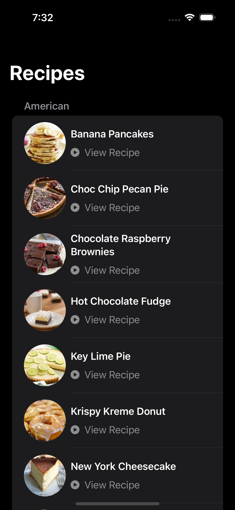
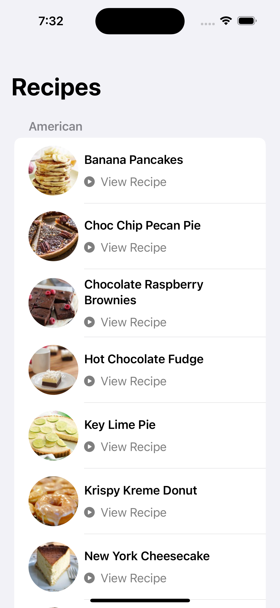

## Recipes
A recipe app that shows various recipes from an API! Made using SwiftUI

### Screenshots
 

### Features
- Gets a list of recipes from an API endpoint
- Links to supported YouTube video to learn how to make the recipe
- JSON saved to file to allow for faster loading and less bandwidth usage

### Technology Used
- **Swift** - Core language
- **SwiftUI** - UI framework
- **URLSession** - Networking
- **File Manager** - Persisting Recipes

### How to Run
1. Clone the repository.
```
git clone https://github.com/DTeakell/Recipes.git
```
2. Open in Xcode.
3. Build and run on an iPhone simulator or physical device.

### Requirements
- **Xcode 15 +**
- **iOS 16 +**
